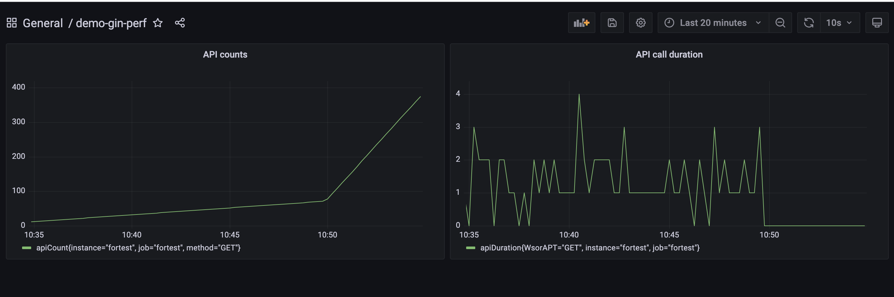

# Flow of gin performance instrumentation with golang-promethus client + promethus + grafana
---

- Start a simple gin project, instrument with go-prometheus client.  Caculate metrics with middleware handler

        go run webserver.go

- Start Prometheus with following config

        global:
        scrape_interval:  15s
        evaluation_interval: 15s

        scrape_configs:
        - job_name: 'fortest'
            metrics_path: '/api/v1/metrics'
            static_configs:
            - targets: ['host.docker.internal:8080'] # <- to access docker host machine
                labels:
                instance: 'fortest'

    run prometheus with docker 

        docker run -t \
            -p 9090:9090 \
            -v <path to prometheus.yml on your machine>:/etc/prometheus/prometheus.yml \
            prom/prometheus

- You should see prometheus scrape metrics from the gin webserver now.

- Start grafana within docker container and Config grafana dash with settings in grafana_dash folder. (default credential: admin/admin)

        docker run -d -p 3000:3000 grafana/grafana-enterprise 

    Note that when connect grafana with prometheus, the connection string should be "http://host.docker.internal:9090" instead of "http://localhost:9090"

- Sample dash configuration in grafana_dash/demo_dash.json

    

